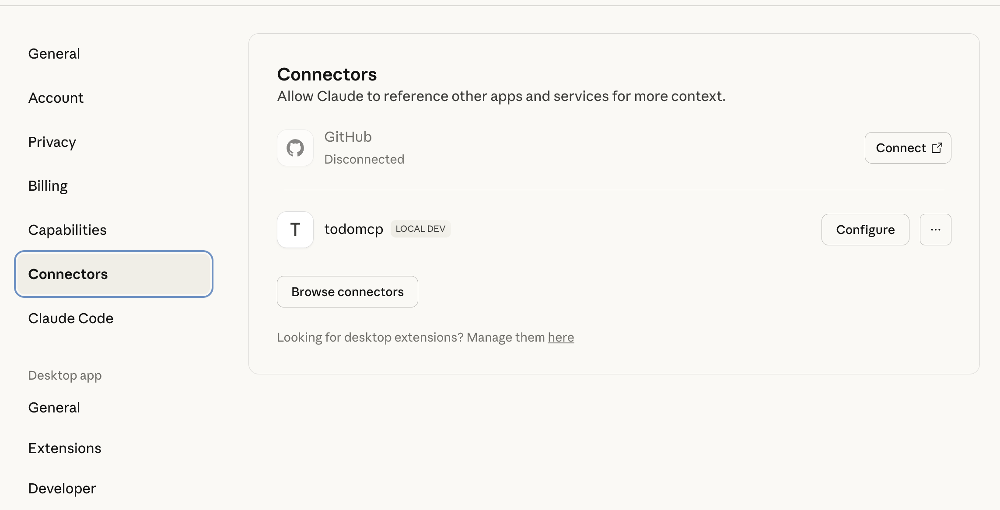
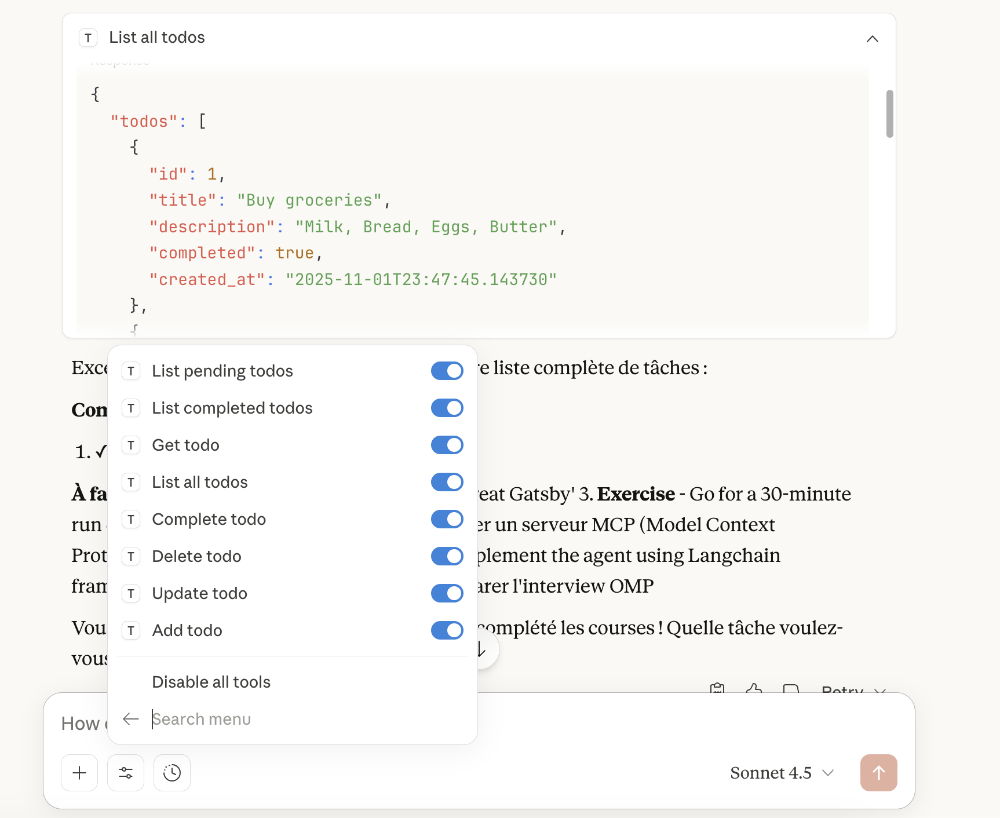

# Todo MCP Agent

This project is a Todo manager that uses a custom AI agent built with LangChain to manage a todo list. The agent is connected to a local MCP server and can be used with Claude Desktop. The project also includes a Langsmith test to verify the agent's functionality.

## Project Structure

The project is divided into two main directories:

- `todo-mcp`: This directory contains the backend of the todo manager. It includes a database, models, and a server that exposes a set of tools to manage the todo list.
- `ai-agent`: This directory contains the AI agent that connects to the `todo-mcp` server and uses its tools to manage the todo list.

## Getting Started

To get started with the project, you need to have Python 3.11 or higher installed. You also need to have `uv` installed to run the `todo-mcp` server.

### Installation

1. Install the dependencies for the `todo-mcp` server:

```bash
cd todo-mcp
uv venv
uv sync
```

2. Install the dependencies for the `ai-agent`:

```bash
cd ../ai-agent
uv venv
uv sync
```

### Running the `todo-mcp` Server

To run the `todo-mcp` server, you need to have `uv` installed. You can run the server with the following command:

```bash
uv run server.py
```

To add some pre-populated todos to the database, you can run the following command:

```bash
uv run seed.py
```

### Running the `ai-agent`

To run the `ai-agent`, you need to have your `GOOGLE_API_KEY` set in your environment variables. You can run the agent with the following command:

```bash
uv run main.py
```

The agent will connect to the `todo-mcp` server and you can start managing your todo list.

You can also test the agent using Langsmith. You need to create a Langsmith account and set the `LANGSMITH_API_KEY` environment variable.

Run the following command to start the studio

```bash
uvx --refresh --from "langgraph-cli[inmem]" --with-editable . --python 3.11 langgraph dev --allow-blocking
```

## Connection to MCP Client

To connect the agent to the local MCP server to an mcp client like claude desktop, you need to set the content of `claude_desktop_config.json` in order to add your local MCP server address.

```json
{
    "mcpServers": {
        "todomcp": {
            "command": "uv",
            "args": [
                "--directory",
                "absolute_path/to/todo-mcp",
                "run",
                "server.py"
            ]
        }
    }
}
```

## Screenshots

Here are some screenshots of the project in action:

**Connection to Local MCP in Claude Desktop**




**Integration Call in Claude Desktop**



**Langsmith Test**


## Contributing

Contributions are welcome! Please open an issue or submit a pull request if you have any improvements or new features to add.